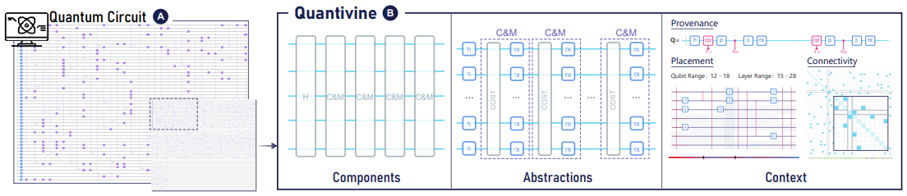
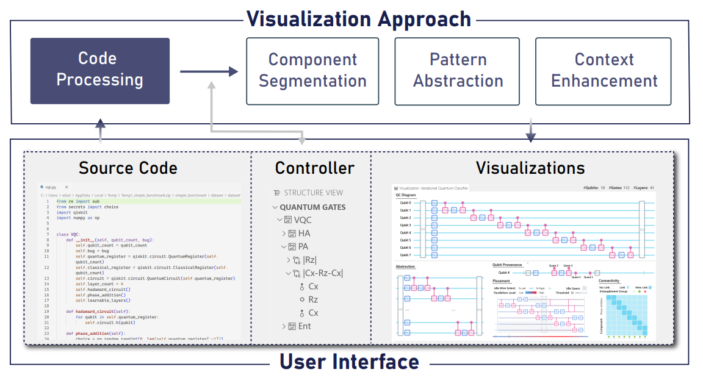

# Quantivine: A Visualization Approach for Large-scale Quantum Circuit Representation and Analysis

Here is the official implementation of the system in paper ["Quantivine: A Visualization Approach for Large-scale Quantum Circuit Representation and Analysis"]().



We implemented the system as an extension of Visual Studio Code, named ***Quantivine***.

## Description
Quantivine is a powerful tool designed for visualizing scalable quantum circuits, and supports interactive exploration and analysis.

### Architecture


Quantivine is built with a modular architecture consisting of three main modules:

- [**Code Processor**](scripts/) - This module is responsible for parsing the code of quantum circuits. It performs semantic analysis on the code to extract the circuit, using Python scripts.
- [**Data Processor & Controller**](src/) - The circuit information is processed in the backend, supported by *Node.js*.
- [**Visualizer**](webview-ui/) - The circuit information is visualized in the frontend supported by *React.js*.

### Features
Quantivine offers several key features to enhance the visualization and analysis of large-scale quantum circuits:
- **Component Segmentation**: Quantivine provides a component segmentation feature that automatically break down a quantum circuit into hierarchical components,
allowing users to visually identify and interactively explore different components of the quantum circuit.
This feature helps in understanding the structure of the circuit in multi-level perspectives.
- **Pattern Abstraction**: Quantivine supports pattern abstraction, which abstract and simplify repetitive parts of a quantum circuit. This feature is particularly useful for large-scale circuits with numerous gates and qubits, enabling users to focus on the essential aspects of the circuit and quickly identify patterns or similarities.
- **Context Enhancement**: Context enhancement is a feature in Quantivine that provides additional contextual information about the quantum circuit. This feature is designed to uncover contextual details such as qubit
provenance, parallelism, and entanglement.

These features combine to provide a powerful visualization approach that facilitates the analysis and comprehension of large-scale quantum circuits.

## Install

### Local

To install and run Quantivine locally, follow these steps:
1. Clone this repository to your local machine and change to the project root directory in your terminal.
2. Run `npm install && cd webview-ui && npm install` to install the necessary dependencies.
3. After the installation is complete, run `npm run build` to build the frontend.
4. Open the project in Visual Studio Code and press `F5` to start.


### VS Code Market

At the moment, Quantivine is a work in progress and is not ready for publication on the VS Code Market. 

However, we are actively developing new features and fixing bugs to improve the system. 

Once it is ready, it will be made available on the VS Code Market for easy installation and usage. 

Stay tuned for updates on its release!

## Usage

Before using Quantivine, please ensure that your Python code can run in the Visual Studio Code workspace and that the corresponding environment is properly configured (choose correct Python interpreter in workspace).

To visualize a quantum circuit, follow these steps:

1. Click on the “Build QC” button and wait for the Python script to finish running.

2. After the building has completed, click on the “View QC” button.

### Set the target of the quantum circuit

When you click on the “Build QC” button, you will be prompted to input a variable name that defines the target circuit to be visualized. The target refers to the specific circuit you want to display.

For example, consider the following Python code:
```python
from qiskit import QuantumCircuit

def ExampleCircuit():
    circuit = QuantumCircuit(2)
    circuit.h(0)
    circuit.cx(0, 1)
    circuit.h(0)
    return circuit

qc = ExampleCircuit()
```
In this example, the target circuit variable is `qc`.

To set the default target, follow these steps:

1. Press `Ctrl + Shift + P` to open the command palette.
2. Search for “Preferences: Open User Settings” and select it.
3. In the settings search bar, enter “qctarget” to find the corresponding setting.
4. Set the desired default value for the target circuit variable.


## Citation
```
@article{
  author    = {Zhen Wen and
               Yihan Liu and
               Siwei Tan and
               Jieyi Chen and
               Minfeng Zhu and
               Dongming Han and
               Jianwei Yin and
               Mingliang Xu and
               Wei Chen},
  title     = {Quantivine: A Visualization Approach for Large-scale Quantum Circuit Representation and Analysis},
  year      = {2023},
  doi       = {},
}
```