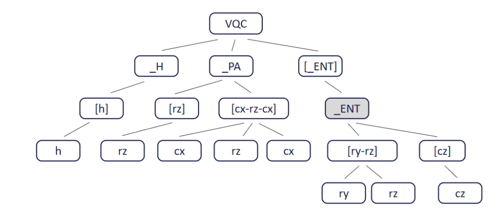
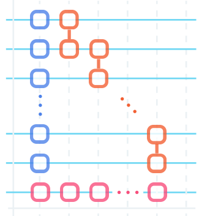

# 数据类型说明（旧版）

代码生成过程输出两种类型的json数据，一种是执行过程中生成的xxx-json-data.json，另一种是静态生成的xxx-structure.json

后续说明以vqc这个算法为例



图1

## json-data

执行过程中生成的

分为layers和semantics两个部分  

### layers(gates):

其实记录的是门的信息，**后续可以改成**`gates`

```
[["h", [0], [0, 0], 3, [0, 1, 2]]],
[["h", [1], [1, 1], 3, [0, 1, 3]]],
[["h", [2], [2, 2], 3, [0, 1, 4]]],
[["h", [3], [3, 3], 3, [0, 1, 5]]],
[["h", [4], [4, 4], 3, [0, 1, 6]]],
[["h", [5], [5, 5], 3, [0, 1, 7]]],
[["h", [6], [6, 6], 3, [0, 1, 8]]],
```
**后续少一层括号：**

```
["h", [0], [0, 0], 3, [0, 1, 2]],
["h", [1], [1, 1], 3, [0, 1, 3]],
["h", [2], [2, 2], 3, [0, 1, 4]],
["h", [3], [3, 3], 3, [0, 1, 5]],
["h", [4], [4, 4], 3, [0, 1, 6]],
["h", [5], [5, 5], 3, [0, 1, 7]],
["h", [6], [6, 6], 3, [0, 1, 8]],
```
量子门类型、qubit，timestamp，treeIndex，nodepath

qubit：qubit_index

timestamp：门的执行起止时间，只考虑门

treeIndex：树结构中的节点编号，图1中从0开始dfs序编号

nodepath：执行过程中经过的函数和门的unique_index（如上面的数据前两个数字是函数（在一个循环中调用多次同一个函数，这个函数的unique_index会叠加），最后一个数字是当前这个门）

### semantics：

```
"semantics": [
    {
      "type": "vertical",
      "range": [0, 49, 1],
      "treeIndex": 2
    },
    {
      "type": "vertical",
      "range": [50, 99, 1],
      "treeIndex": 5
    },
    {
      "type": "diagonal",
      "range": [100, 246, 3],
      "treeIndex": 7
    },
    {
      "type": "vertical",
      "range": [247, 346, 2],
      "treeIndex": 13
    }
  ]
```

type：循环的类型：vertical（图2中蓝色）/Horizontal（粉色）/diagonal（橙色）三种

 

图2

range：循环起始、循环终止、每次循环的单位长度，**后续需要改成每段循环的起终点**

treeIndex：树上的节点编号

## structure

静态生成的，树状结构

```
  { "name": "_Unitary", "parentIndex": 1, "index": 2, "type": "fun" },
  { "name": "[ry]", "parentIndex": 2, "index": 3, "type": "rep" },
  { "name": "ry", "parentIndex": 3, "index": 4, "type": "rep_item" },
```

节点名、父节点编号、该节点编号、节点类型

节点名：`_`+函数名、`[]`+循环名，上述例子中的"ry"是基础门的名字，与json-data中的量子门类型对应

节点类型：fun/rep/rep_item，fun：函数、rep：循环、rep_item：循环基本单元（基础量子门）

> 之前生成的数据中有一些限制不能让循环直接套循环，例如在两层数据中加入一层函数，形成循环->函数->循环的形式，如图1中灰色节点，**这部分后续不用考虑**